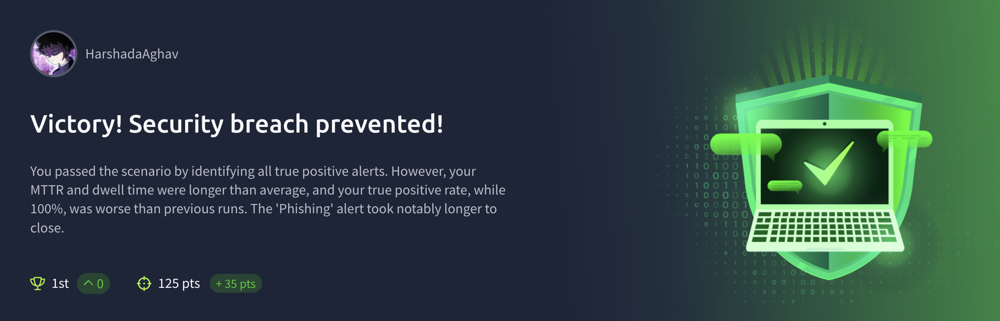
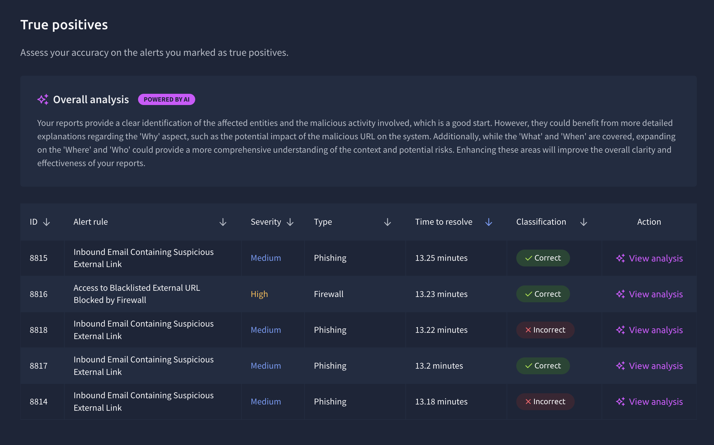
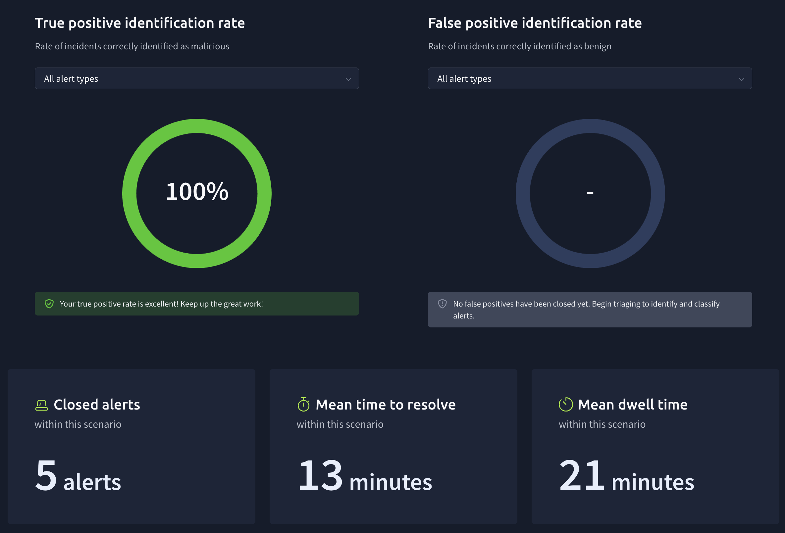

# TryHackme SOC Simulation Lab

# SOC Alert Triage and Phishing Investigation Lab

## Overview

This repository documents a hands-on Security Operations Center investigation
completed through the TryHackMe SOC Simulator.

The scenario involved reviewing simulated phishing and firewall alerts,
identifying malicious activity, classifying alerts, documenting investigation
findings, and recommending appropriate response actions.

This was a simulated training environment and did not involve a real security
incident or production system.

## Scenario Objectives

- Review incoming security alerts
- Identify true-positive security events
- Investigate suspicious email links and blocked external URLs
- Determine whether the observed activity was malicious or benign
- Document the affected entities, evidence, potential impact, and response
- Improve investigation speed and reporting quality

## Alert Categories Investigated

### Phishing Alerts

Alert rule:

`Inbound Email Containing Suspicious External Link`

The investigation focused on determining whether an external link delivered
through email represented malicious phishing activity.

### Firewall Alert

Alert rule:

`Access to Blacklisted External URL Blocked by Firewall`

The investigation focused on reviewing an attempted connection to a
blacklisted external destination and determining the associated security risk.

## Investigation Workflow

1. Reviewed the alert name, severity, timestamp, and source.
2. Identified the affected user, host, email, or network entity where available.
3. Examined the suspicious URL and related activity.
4. Correlated available email, firewall, endpoint, and network information.
5. Assessed whether the behaviour was expected or suspicious.
6. Classified the alert based on the available evidence.
7. Documented the findings and potential impact.
8. Recommended containment, escalation, or closure actions.

## Scenario Results

### Scenario Completion

Successfully completed the simulated SOC scenario by investigating five security alerts and identifying all true-positive alerts.

### Performance Metrics

| Metric | Result |
|---|---:|
| Alerts investigated and closed | 5 |
| True-positive identification rate | 100% |
| Mean time to resolve | 13 minutes |
| Mean dwell time | 21 minutes |
| Scenario points | 125 |

No false-positive alerts were closed during this scenario; therefore, a false-positive identification rate was not calculated.

### Alert Investigation Results

The scenario included four phishing alerts involving suspicious external links and one high-severity firewall alert involving access to a blacklisted external URL.

The simulator reported a 100% overall true-positive identification rate. However, two individual investigation reports were marked incorrect. The feedback showed that my reports needed more detail about why the activity was malicious, who and where it affected, and its potential impact.

I used this feedback to improve my reporting approach by following the **5W1H framework**:

- **What:** What activity occurred?
- **When:** When did the event occur?
- **Where:** Which system, endpoint, or network location was affected?
- **Who:** Which user or entity was involved?
- **Why:** Why was the activity considered suspicious or malicious?
- **How:** How should the incident be contained, escalated, or resolved?

## Disclaimer

This repository documents a hands-on cybersecurity investigation completed in the TryHackMe SOC Simulator. All alerts, systems, users, and incidents were part of a simulated training environment.

https://tryhackme.com/soc-sim/public-summary/4c56e7fa3931a1d86732297708cb6630a63a2a516bdbfa21e8df62b2a122efec5d6f317f41056c028b3c5a8993998619

